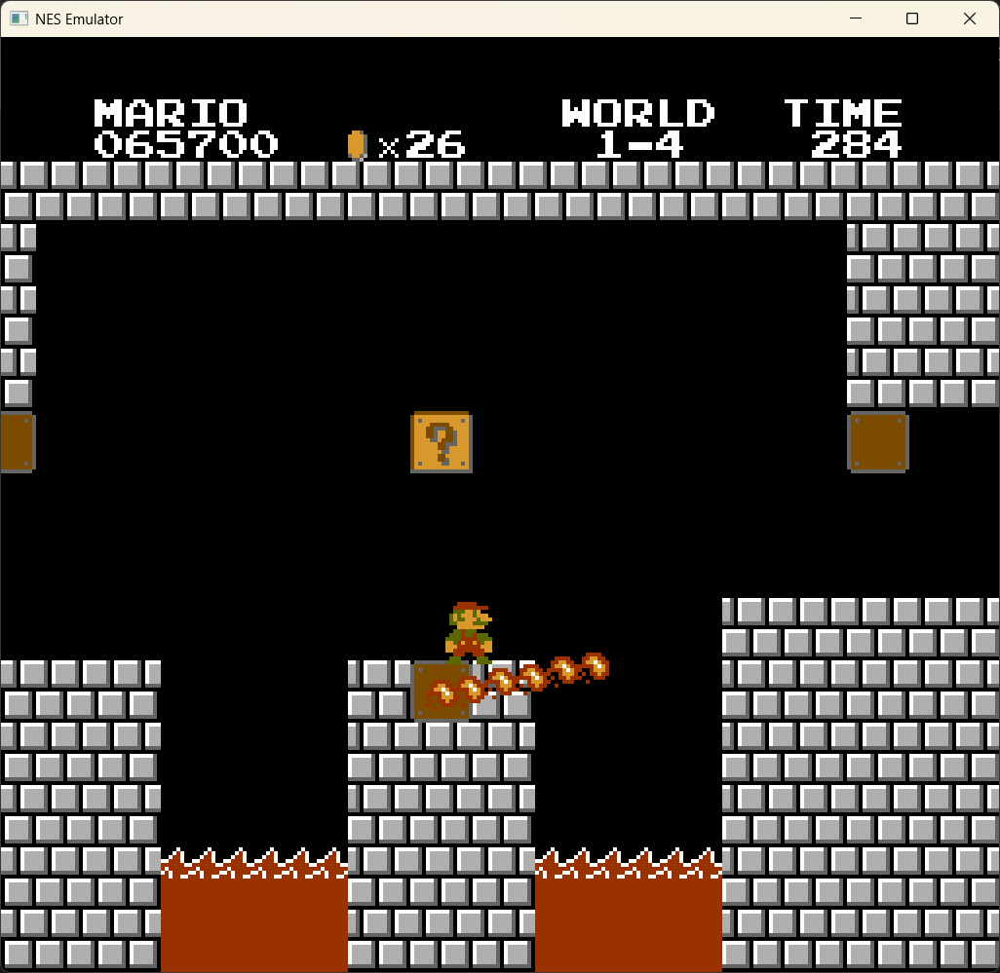
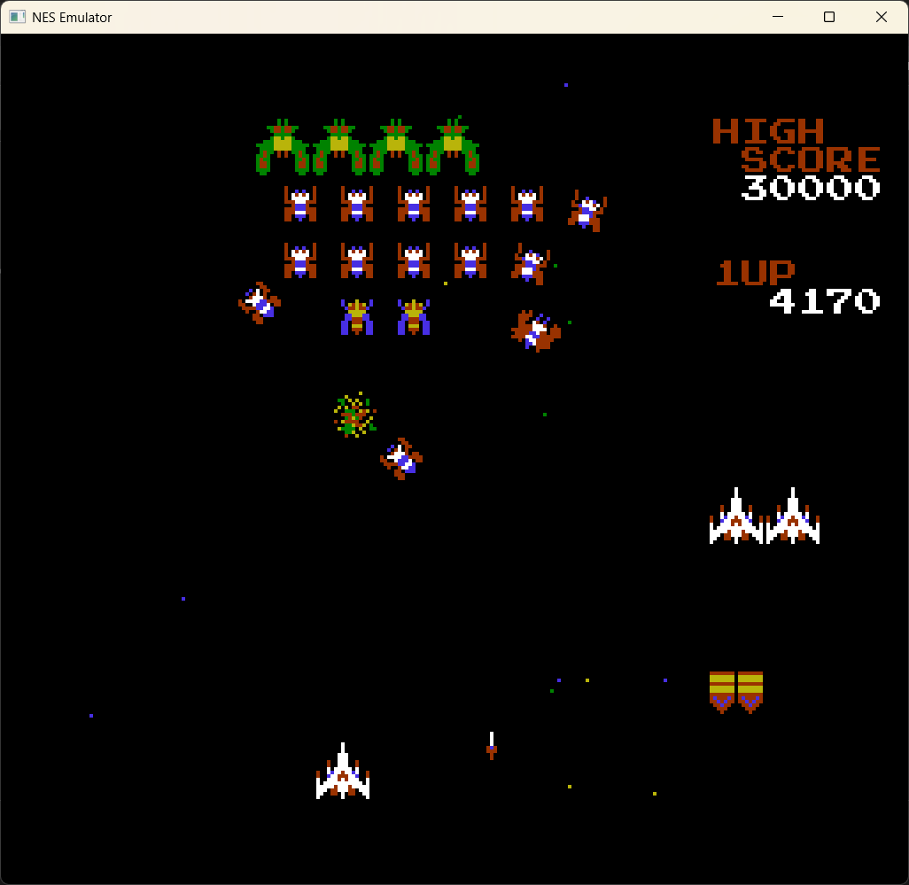
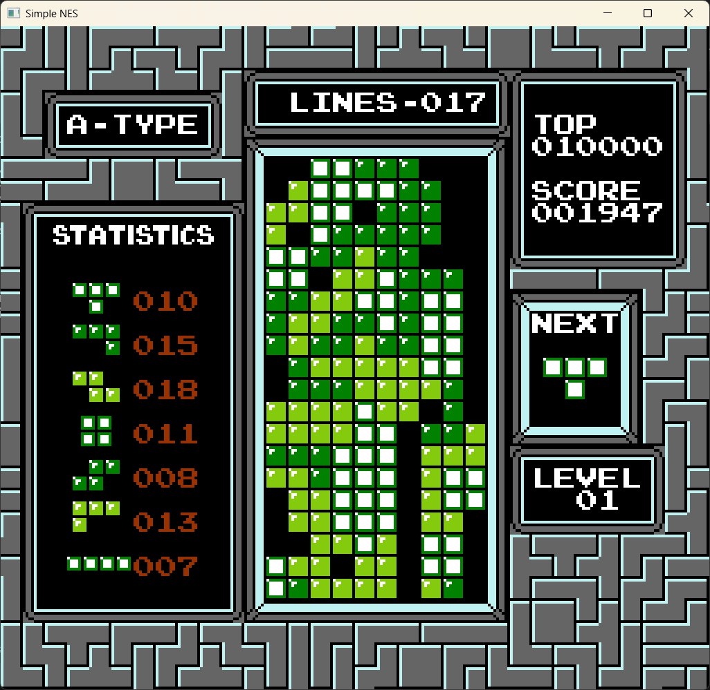
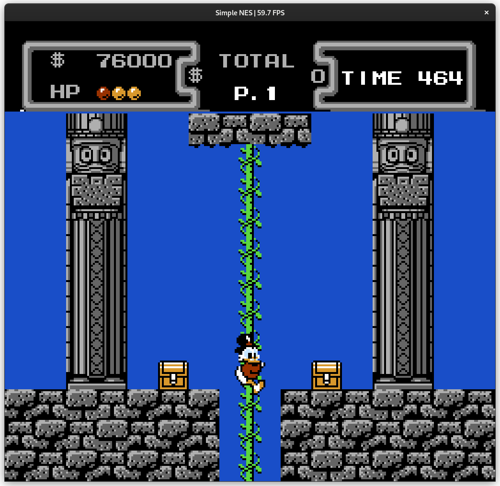

# Simple-NES

SimpleNES is a simple, work in progress nes emulator. It is designed to run classic NES games and is built with simplicity and portability in mind.

<p align="center">


</p>

---

# Features

## Emulation
- **CPU Emulation**: 
   - [x] Official instructions
   - [ ] Unofficial instructions
- **PPU Rendering**: 
   - [x] Background rendering
   - [x] Sprite rendering
- **APU Output**: 
   - [x] Pulse channel 1
   - [x] Pulse channel 2
   - [ ] Triangle channel
   - [ ] Noise channel
   - [ ] Delta Modulation Channel (DMC)

## Supported mappers
- ***Mapper 00***:
   - [x] **NROM**
- ***Mapper 01***:
   - [x] **MMC1**
   - [ ] **SxROM**
- ***Mapper 02***: 
   - [x] **UxROM**
- ***Mapper 07***: 
   - [x] **AxROM**
- ***Mapper 71***: 
   - [x] **UxROM** (emulated like mapper 2)

---

## Getting Started

### Requirements
To build and run the emulator, ensure you have the following installed:

- **CMake** (version 3.15 or higher)
- **GCC** or **MinGW** (for Windows builds)
- **CSFML** (used for rendering and input handling), included in the `setup.bat` file
- **WASAPI** (Windows Audio Session API, already included in Windows SDK)

### Setup

#### Windows
1. Clone the repository:
   ```bash
   git clone https://github.com/EtienneMaire37/simple-nes.git
   cd simple-nes
   ```

2. Run the setup script to download and configure dependencies:
   ```bash
   setup.bat
   ```

3. Build the project using CMake:
   ```bash
   mkdir build
   cd build
   cmake -G "MinGW Makefiles" ..
   cmake --build . --config Release
   ```

#### Linux (Debian-style)
1. Clone the repository:
   ```bash
   git clone https://github.com/EtienneMaire37/simple-nes.git
   cd simple-nes
   ```

2. Install dependencies:
   ```bash
   sudo apt install libcsfml-graphics2.5 libcsfml-audio2.5 libcsfml-dev libcsfml-doc libcsfml-network2.5 libcsfml-system2.5 libcsfml-window2.5
   ```

3. Build the project using CMake:
   ```bash
   mkdir build -p
   cd build
   cmake ..
   cmake --build . --config Release
   ```

The executable will be located in the `build/bin/` folder.

### Usage
1. Run the emulator:
   ```bash
   ./build/bin/simple-nes.exe <path-to-rom>
   ```
2. Controls:

| Action | Key |
|--------|-----------|
| Controller **A** | **C** |
| Controller **B** | **X** |
| Controller **D-pad** | **Arrow keys** |
| Controller **Start** | **LShift** |
| Controller **Select** | **LControl** |
| **Pause/Resume emulation** | **Space** |
| **Change palette** | **Ctrl+P** |
| **Reset** | **Ctrl+R** |
| **Power-cycle** | **Ctrl+U** |
| **Switch TV system (NTSC or PAL)** | **Ctrl+T** |
| **Toggle fullscreen** | **F11** |

## Screenshots










---

## Contributing
Contributions are welcome! Feel free to fork the repository, make improvements, and submit a pull request. Suggestions and bug reports can be submitted to [Issues](https://github.com/EtienneMaire37/simple-nes/issues).

---

## License
This project is licensed under the MIT License. See the `LICENSE` file for details.

---

## Acknowledgments
- Special shoutout to the NESdev community for their great wiki and test ROMs.
- Inspired by the Mesen emulator.
